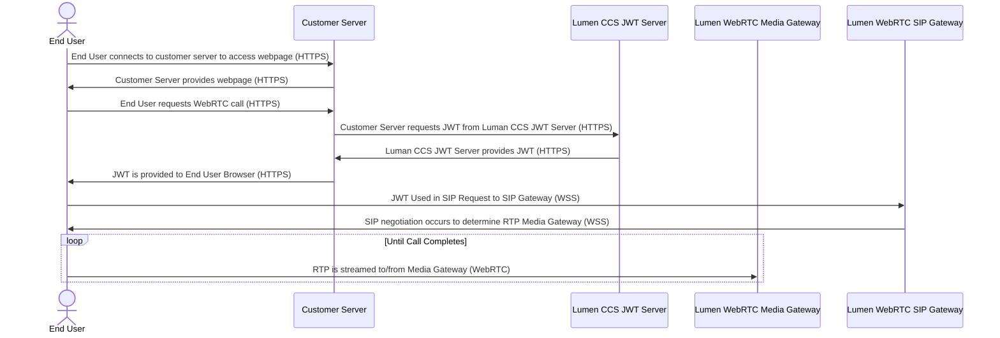

# Lumen CCS WebRTC SDK

Example code and libraries to make a WebRTC enabled call through the Lumen CCS platform.

## How To

To run the example contained in this repository:

1. Ensure you have the `.env` file provided by your Lumen CCS contact
2. Install python dependencies with `pip install -r requirements.txt`
    - optionally utilize a python virtual environment
        - `python3 -m venv venv`
        - `source venv/bin/activate`
        - `pip install -r requirements.txt`
3. Run the server with `FLASK_APP=main.py flask run --port 5001`
    - this is a development server, not for production use
4. Connect to `http://localhost:5001/webrtc-calls`
5. Click on the desired call button
6. Hangup (if desired)

## SDK

The SDK, `whistle-engine.js`, provides primitives to interface with the [JsSIP Library](https://jssip.net/) in a convenient fashion, allowing for easy registration of callbacks and a simplified interface.

Example usage of the `whistle-engine.js` SDK:

```javascript
var config = {
    'user': '< FROM USER >',
    'domain': '< DOMAIN for USERS >',
    'proxy': '< SIP Gateway (often the same as domain) >',
    'port': 443,
    'authorization_jwt': `Bearer < JWT >`,

    // optional hooks to customize functionality
    'call_failed': function () {}
    'call_connected': function () {}
    'call_disconnected': function () {}
    'call_ended': function () {}
    'incoming_call': function () {}
};

engine = new WhistleEngine();
engine.start(config);
engine.dial("+1234567890");
```

## Lumen CCS WebRTC Flow



## Structure of Example Application

This repo contains several components used to generate necessary authentication credentials as well as host a simple website used for demonstrating a WebRTC call.

| Object | Function |
| ------ | -------- |
| [static](./static/) | This folder contains both the underlying SIP library [JsSIP](./static/jssip-3.10.0.js) as well as the [SDK](./static/whistle-engine.js) |
| [templates](./templates/) | This folder contains the sample HTML [document](./templates/webrtc-calls.html) that the [Flask](https://flask.palletsprojects.com/en/3.0.x/) application renders with the requested config|
| [main.py](./main.py) | This is the Python web application that will serve both the HTML document as well as interface with the Lumen CCS JWT Service |
| [requirements.txt](./requirements.txt) | This contains the list of required Python dependencies and versions, used for setup |
| [.env.example](./.env.example) | This contains the example environment variables used to configure the Flask application |
| [Dockerfile](./Dockerfile) | The Dockerfile contains instructions for building the application as a Docker image as an alternate method of running |
